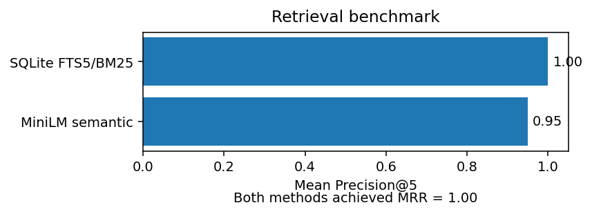

# Biomedical Literature Search with Hugging Face + SQL

An end-to-end biomedical literature retrieval and classification project that moves from a controlled prototype to a curated PubMed benchmark.

The core idea is simple: **evaluate model complexity against a credible baseline rather than assuming a transformer is automatically better.**

## Project summary

I built a reproducible workflow for biomedical literature retrieval and topic classification using SQL and pretrained Hugging Face models. The project includes PubMed acquisition, manual corpus curation, SQLite data modeling, lexical retrieval, semantic retrieval, zero-shot classification, quantitative evaluation, and paper-level error analysis.

The real-data benchmark contains **80 manually reviewed PubMed papers** across four topics:

- `white_matter_connectivity`
- `eeg_memory`
- `neurodevelopment`
- `pediatric_complex_care`

Main result: on this small, terminology-rich benchmark, the conventional lexical baseline slightly outperformed MiniLM semantic retrieval. That result is useful because it demonstrates model selection based on evidence rather than novelty.

## Key results

<p align="center">
  
</p>

**Zero-shot classification:** DeBERTa achieved **87.5% accuracy** and **macro-F1 = 0.875** on the 80-paper PubMed corpus without task-specific fine-tuning.

The lexical baseline slightly outperformed MiniLM on the four retrieval questions, although MiniLM's sole cross-topic result was still scientifically relevant to the query, illustrating an important limitation of strict single-topic relevance labels.

For zero-shot classification, correct predictions had higher mean confidence (**0.614**) than errors (**0.368**), with most mistakes occurring at interpretable boundaries between overlapping biomedical topics.

## Why this project matters

Biomedical literature search is a useful test case for a broader engineering problem: **how should simple retrieval methods and pretrained language models be combined in document-heavy workflows?**

A transformer can provide semantic flexibility, but it also adds complexity, compute requirements, dependencies, and latency. This project therefore treats a strong lexical method as a baseline rather than a straw man.

The result suggests a practical design principle:

> Start with the simplest method that satisfies the task, then add semantic modeling where it provides measurable value.

That principle extends beyond PubMed and applies to many search, triage, and knowledge-management systems.

## Potential applications

Although the benchmark uses biomedical literature, the same architecture can be adapted to other document-heavy workflows, including:

- scientific literature surveillance
- internal knowledge-base search
- evidence-review and document-triage pipelines
- regulatory or policy document retrieval
- patent and technical-document search
- research-monitoring systems
- domain-specific document classification

The existing lexical and semantic components also provide a natural foundation for a **hybrid retrieval pipeline**: use fast lexical search to generate candidate documents, then apply semantic reranking or classification only where it adds value.

## Workflow

The notebook develops the project in four stages:

1. **Deterministic prototype**  
   A small synthetic biomedical corpus validates the SQL, embedding, retrieval, classification, and evaluation code before real data are introduced.

2. **Curated PubMed retrieval benchmark**  
   PubMed candidates are generated programmatically, manually reviewed, and reduced to a balanced 80-paper corpus. SQLite FTS5/BM25 and MiniLM semantic retrieval are evaluated on the same information needs and labels.

3. **Retrieval disagreement analysis**  
   Ranked results are retained at the paper level so the aggregate metrics can be traced back to specific documents.

4. **Real-data zero-shot classification**  
   A DeBERTa MNLI model assigns one of four natural-language topic labels without task-specific fine-tuning. Performance is evaluated with accuracy, macro-F1, a confusion matrix, confidence analysis, and manual inspection of errors.

## Technical stack

- Python 3.12
- SQL / SQLite
- SQLite FTS5 / BM25
- pandas / NumPy
- scikit-learn
- PyTorch
- Hugging Face Transformers
- Sentence Transformers
- Matplotlib
- PubMed / NCBI E-utilities

## Models

- `sentence-transformers/all-MiniLM-L6-v2` — document/query embeddings and semantic retrieval
- `MoritzLaurer/DeBERTa-v3-base-mnli` — zero-shot topic classification

No model is fine-tuned on the project corpus.

## Data and reproducibility

The repository commits the curated identifier/label manifest rather than a static copy of PubMed abstracts:

```text
data/pubmed_labels.csv
```

The final corpus contains **80 manually reviewed papers, 20 per topic**. Candidate-search provenance is not used as the gold label; papers are assigned according to their primary scientific or clinical focus.

Full titles and abstracts are fetched locally from PubMed and written to the ignored cache directory. This keeps acquisition reproducible while avoiding unnecessary redistribution of abstract text.

## Run locally

Create and activate a virtual environment:

```bash
python -m venv .venv
source .venv/bin/activate
pip install -r requirements.txt
```

Fetch the curated PubMed corpus:

```bash
export NCBI_EMAIL="your-email@example.com"
python scripts/fetch_curated_pubmed.py
```

Then launch Jupyter:

```bash
jupyter notebook
```

Open:

```text
biomedical_literature_search_hf_sql.ipynb
```

The first run downloads pretrained model weights from Hugging Face.

## Evaluation

### Retrieval

Both retrieval approaches are evaluated with:

- **Precision@5** — proportion of the first five results belonging to the expected topic
- **Reciprocal rank** — inverse rank of the first relevant result
- **MRR** — mean reciprocal rank across information needs

FTS5 receives Boolean/phrase queries appropriate for lexical search, while MiniLM receives natural-language versions of the same underlying information needs.

### Classification

Zero-shot classification is evaluated with:

- accuracy
- macro-F1
- confusion matrix
- confidence summaries
- paper-level error inspection

The classifier receives only candidate label descriptions at inference time; no labeled training examples from the benchmark are provided.

## Why the baseline matters

On this small, balanced, terminology-rich corpus, **SQLite FTS5/BM25 performs extremely well** and slightly exceeds MiniLM's Precision@5. That is a useful outcome rather than a failed experiment: the project demonstrates model selection based on evidence rather than novelty.

The disagreement analysis also shows why aggregate metrics need context. MiniLM's only cross-topic top-five result was a neurodevelopment paper about the development of structure-function coupling and white-matter architecture — semantically relevant to the white-matter/connectivity query even though its single gold label belonged to another class.

## Future directions

The most useful next improvements follow directly from the limitations observed in the benchmark:

- **Hybrid lexical + semantic retrieval:** use BM25 for candidate generation and MiniLM for semantic reranking.
- **Query-specific relevance judgments:** evaluate whether a paper actually answers a given information need rather than treating broad topic membership as relevance.
- **Multi-label classification:** allow papers to belong to overlapping scientific domains instead of forcing one primary label.
- **Larger-scale indexing:** expand from tens of papers to thousands or millions and introduce a scalable vector or hybrid index.
- **Human-in-the-loop review:** route low-confidence or cross-topic cases for manual inspection.
- **Broader query testing:** add paraphrased, ambiguous, and terminology-mismatched queries where semantic retrieval may offer more value.
- **Workflow orchestration:** package lexical retrieval, semantic reranking, and review logic into a reusable multi-stage pipeline.

These extensions would move the project from a compact benchmark toward a more realistic literature-triage or knowledge-retrieval system.

## AI-assisted development

This project was developed iteratively with AI coding assistance. The workflow included environment debugging, dependency pinning, query design, code review, and refactoring with AI support, while the PubMed corpus was manually reviewed and the final benchmark labels were human-curated.

The Git history is intentionally preserved to show that progression from prototype through debugging, real-data acquisition, evaluation, and refinement.

## Limitations

This is a compact portfolio benchmark rather than a production search engine or definitive scientific benchmark:

- only 80 papers and four balanced topic classes;
- one primary-topic label per paper rather than multi-label/query-specific relevance;
- only four retrieval information needs;
- targeted PubMed candidate generation rather than a representative PubMed sample;
- one embedding model and one zero-shot classification model;
- classifier confidence is not calibrated.

## 30-second project summary

> I built an end-to-end biomedical literature retrieval and classification workflow using SQL and Hugging Face pretrained transformers. I validated the pipeline on synthetic data, generated and manually curated an 80-paper PubMed benchmark, compared SQLite FTS5/BM25 against MiniLM semantic retrieval, and inspected disagreement cases rather than relying only on aggregate metrics. I also evaluated DeBERTa zero-shot classification on the real corpus, achieving 87.5% accuracy and macro-F1 of 0.875 with confusion-matrix, confidence, and failure-case analysis.
